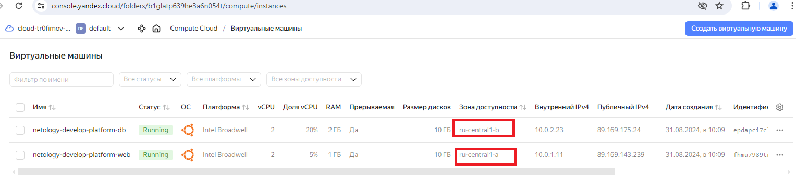

Задание 1

1.В файле variables.tf определены типы переменных и некоторые дефолтные значения.

2.eugene@Ubuntu22LTS:~$ ls -a .authorized_key.json 
.authorized_key.json

3. ssh-keygen -t ed25519

4.а)Закоментировал переменную token, т.к используется метод "service_account_key_file = file("~/.authorized_key.json")"

б)Указал корректный family main.tf:

data "yandex_compute_image" "ubuntu" {
  family = "ubuntu-2004-lts-oslogin"
}

в)platform_id = "standard" и сores = 2
resource "yandex_compute_instance" "platform" {
  name        = "netology-develop-platform-web"
  platform_id = "standard"
  resources {
    cores         = 2

5.

preemptible = true

Прерываемые виртуальные машины — это виртуальные машины, которые могут быть принудительно остановлены в любой момент.

https://yandex.cloud/ru/docs/compute/concepts/preemptible-vm

core_fraction=5

Базовый уровень производительности vCPU.

https://yandex.cloud/ru/docs/compute/concepts/performance-levels

Задание 2

main.tf:

variables.tf:

 

Задание 3

Добавил необходимые переменные в файл "vms_platform.tf", "variables.tf", "main.tf"

Задание 4

Задание 5

locals.tf:

locals {  
vm_web = "${var.project}-${var.vm_web}"  
vm_db = "${var.project}-${var.vm_db}"
}

variables.tf:

variable "project" {  default = "netology-develop-platform"}
variable "vm_web" {  default = "web"}
variable "vm_db" {  default = "db"}

main.tf:

resource "yandex_compute_instance" "platfo
rm" {
  name        = local.vm_web
  
resource "yandex_compute_instance" "platform2" {
  name        = local.vm_db

Задание 6

